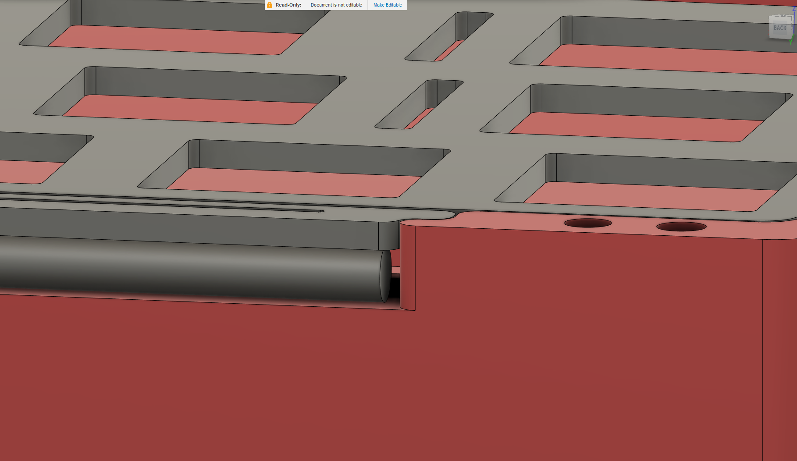

# No Thock

Keyboard in 60% with open source design.

## Specs
- seamless
- "spring" mount with dual oring
- low front height
- ~8.5 angle
- 2.5mm screws
- Unified Daughterboard
- H60/Bakeneko PCB

## Pics

### Case

### Bottom

### Plate

### Mount

**These are for non-commercial use only, and I am not responsible if the files do not work.** 